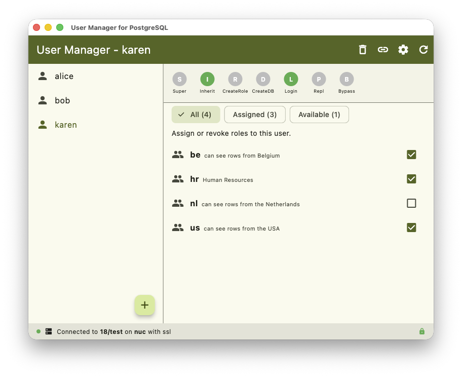
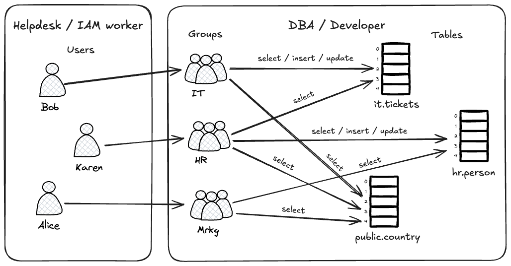
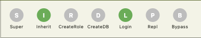

# User Manager for PostgreSQL



## TLDR;
If you are a DBA or software developer this app is for you.  
What do you do with this app? You give it to the helpdesk or security engineer.



Your job, among many other things, is granting privileges to groups.  
The helpdesk or security engineer is responsible for putting users in these groups.

Employees are hired and fired all the time.  
They are promoted and demoted all the time.  
They change departments all the time.

When you work for a middle to large size organization this can take up a lot of your time quickly.  
You don't care if Karen is hired to work in Human Resources.  
That is something that the Helpdesk person can handle by using this app.

## Users, Groups and Roles
```
Although technically correct, the explanation below is an oversimplification of the reality of PostgreSQL roles.
More information can be found here: https://www.postgresql.org/docs/current/user-manag.html
```

PostgreSQL does not have **users** or **groups**.  
Instead, it uses the concept of **roles**, which have attributes and privileges and can be granted to other roles.

PostgreSQL prevents circular inheritance of roles. If role A inherits role B, and role B inherits role A, then PostgreSQL will throw an error.

The following things can be assigned to roles:

### 1. Role Attributes, Constraints and Security Labels

Each role has eight attributes:
- Superuser
- Inherit
- Create Role
- Create DB
- Login
- Replication
- Bypass RLS
- Password

When a user is selected on the left side of the screen, his attributes are shown on the right side of the screen:  
  
Of course green means set and grey means not set.  

The `Login` attribute determines if a role can log in to the database.  This is the difference between a "user" and a "group":
- If `Login` is true, it is a **user** and appears on the **left**
- If `Login` is false, it is a **group** and appears on the **right**

From here on, I will use the words `user` and `group` depending on whether the role has the **Login** attribute set to true or false.

Attributes are **not** inherited by child roles. If a group called `DBAs` has the Superuser attribute set to **true**, members of that group are **not** superusers. If the `SET` option is true they can become Superuser however, see the section on [Granting](Granting).

Roles can have constraints by setting a CONNECTION LIMIT or a VALID UNTIL attribute.  
Roles can have security labels (MAC/SELinux) by applying a SECURITY LABEL or COMMENT to the role.

### 2. Object-Level Privileges
There are many different privileges on many different objects.  
The most important ones are:
- SELECT
- INSERT
- UPDATE
- DELETE

These privileges **are** inherited.  
So if a group called `hr` can SELECT, INSERT and UPDATE on table `hr.persons` then
any user that is a member of `hr` can also SELECT, INSERT and UPDATE on `hr.persons`.

Many organizations use this feature to create a system where privileges are granted to groups and users become members of these groups.
Thereby inheriting the privileges of the groups.

Access privileges can be **GRANT**ed and **REVOKE**d on roles for: tables (or [materialized] views), columns, sequences, databases, domains, foreign data wrappers, servers, routines, languages, large objects, configuration parameters, schemas, tablespaces, types and other roles. [*grant*](https://www.postgresql.org/docs/current/sql-grant.html) / [*revoke*](https://www.postgresql.org/docs/current/sql-revoke.html)

<!--
### 03. RLS Policies
```sql
CREATE POLICY policy_name ON table_name 
TO role_name [, ...] 
USING (...) WITH CHECK (...);
```
Policies can also be assigned to roles.
They can be permissive or restrictive.


### 04. Runtime Configuration Settings (GUC Parameters)


### 05. Predefined System Roles


### 06. Object Ownership
Objects have owners. The owner of an object has all privileges on that object.
-->
## Granting
When you grant a group to a user, for example: `grant hr to karen;`
You have three options:
- ADMIN; the user will be able to grant this privilege to other users. Or drop the `hr` role altogether.
- INHERIT; the user can SELECT, UPDATE, INSERT and DELETE any object that the `hr` group can access.
- SET; the user can use the attributes of the `hr` group. Such as BYPASSRLS by using `set role hr`

Role attributes (SUPERUSER, INHERIT, BYPASSRLS etc.) are not inherited. They can only be obtained by switching to that role using `set role <role_name>`. This program uses the default values from PostgreSQL; ADMIN=false, INHERIT=true, SET=true.

## Extra
If you are going to make a login a member of a role, for example: `grant hr to karen;`
Then you must have ADMIN rights on hr. Not per se on karen.

The query to select the users is:
```sql
WITH me AS (
    SELECT 
        current_setting('is_superuser') = 'on' AS is_super,
        rolcreaterole AS can_create
    FROM pg_catalog.pg_roles
    WHERE rolname = CURRENT_USER
),
user_roles AS (
    SELECT
        r.oid::int,
        r.rolname AS name,
        r.rolsuper AS is_superuser,
        r.rolinherit AS inherit,
        r.rolcreaterole AS create_role,
        r.rolcreatedb AS create_db,
        r.rolcanlogin AS can_login,
        r.rolreplication AS replication,
        r.rolbypassrls AS bypass_rls,
        (CURRENT_USER = r.rolname) AS is_current,
        pg_catalog.shobj_description(r.oid, 'pg_authid') AS description,
        (
            me.is_super
            OR EXISTS (
                SELECT 1 FROM pg_catalog.pg_auth_members m
                WHERE m.roleid = r.oid
                  AND m.member = CURRENT_USER::regrole::oid
                  AND m.admin_option = true
            )
        ) AS is_admin,
        me.is_super,
        me.can_create
    FROM pg_catalog.pg_roles r
    CROSS JOIN me
    WHERE r.rolcanlogin
)
SELECT
    oid,
    name,
    is_superuser,
    inherit,
    create_role,
    create_db,
    can_login,
    replication,
    bypass_rls,
    is_current,
    description,
    is_admin,
    (is_admin AND (is_super OR can_create)) AS can_drop
FROM user_roles
ORDER BY name ASC;
```

The query to select the groups of a user is:
```sql
SELECT 
    g.oid::int,
    g.rolname AS name,
    pg_catalog.shobj_description(g.oid, 'pg_authid') AS description,
    COALESCE(
        array_agg(m.grantor::regrole::text ORDER BY m.grantor::regrole::text) 
        FILTER (WHERE m.grantor IS NOT NULL AND m.grantor <> CURRENT_USER::regrole::oid),
        '{}'::text[]
    ) AS grantors,
    (COALESCE(bool_or(me.admin_option), false) OR current_setting('is_superuser') = 'on') AS grantable,
    COALESCE(bool_or(m.grantor = CURRENT_USER::regrole::oid), false) AS granted
FROM pg_catalog.pg_roles g
LEFT JOIN pg_catalog.pg_auth_members m
    ON g.oid = m.roleid
   AND m.member = $1::oid
LEFT JOIN pg_catalog.pg_auth_members me
    ON g.oid = me.roleid
   AND me.member = CURRENT_USER::regrole::oid
   AND me.admin_option = true
WHERE NOT g.rolcanlogin
GROUP BY g.oid, g.rolname
ORDER BY g.rolname;
```

---

## Requirements

- **PostgreSQL**: Version 14 or newer (tested on PostgreSQL 14, 15, 16, and 17).
- **Permissions**: A PostgreSQL role with `CREATEROLE` (**not** `SUPERUSER`) privileges to manage roles and grant memberships.

## Supported Platforms

- **macOS** (Apple Silicon & Intel)
- **Linux** (Debian, Ubuntu, Fedora, Arch)
- **Windows** (Windows 10/11)
- **iOS & iPadOS**
- **Android**

## Security & Credential Storage

- **OS-Level Keyring / Keychain**: Database passwords are never stored in plain text. They are secured using `flutter_secure_storage` backed by Apple Keychain, Windows Credential Manager, Linux Secret Service / Keyring, or Android KeyStore.
- **SSL / TLS**: Supports mandatory SSL/TLS encryption (`sslMode = require`) with live connection security status indicators.

## Running from Source

1. Install the [Flutter SDK](https://flutter.dev/docs/get-started/install) (stable channel).
2. Clone the repository:
   ```bash
   git clone git@github.com:dbroles/postgresql.git
   cd postgresql
   ```
3. Fetch dependencies and run tests:
   ```bash
   flutter pub get
   flutter test
   ```
4. Launch the application:
   ```bash
   # Desktop targets
   flutter run -d macos
   flutter run -d linux
   flutter run -d windows
   ```

## License

This project is licensed under the PostgreSQL / BSD-style License. See [LICENSE](LICENSE) for details.

## Acknowledgements
- [postgres](https://pub.dev/packages/postgres) – Maintained by István Soós ([@isoos](https://github.com/isoos)) and community contributors.
