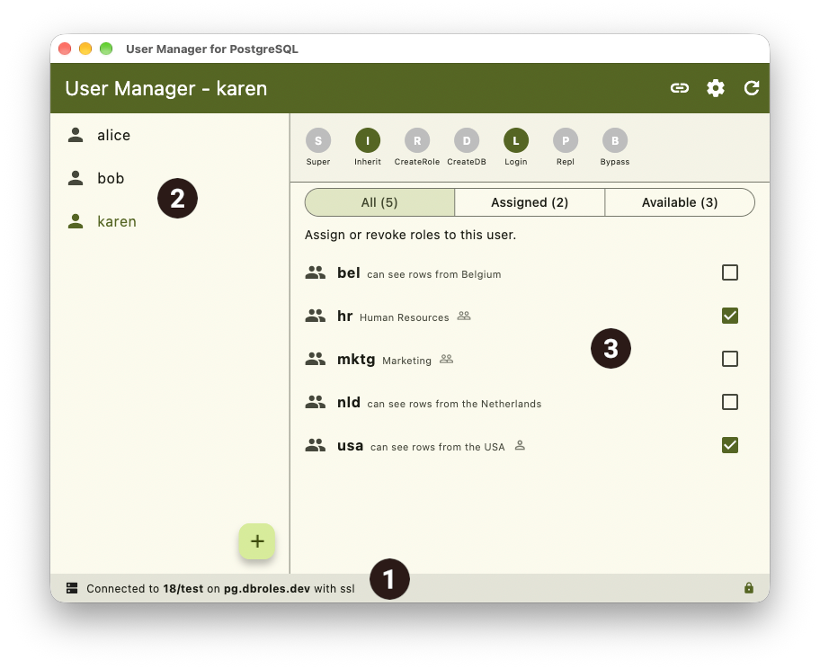
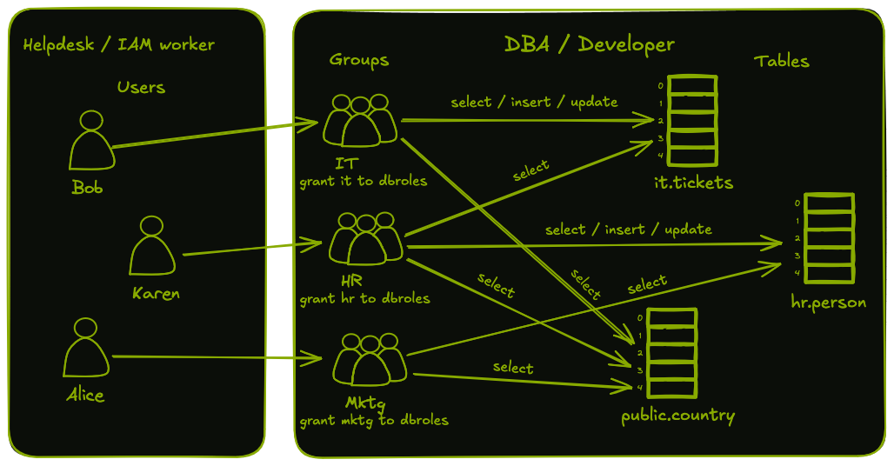

# User Manager for PostgreSQL


## Three steps to get started:
1. **Connect** to a PostgreSQL server
2. **Select** a user
3. **Grant** privileges (or **revoke**)

## TLDR;
If you are a DBA or software developer this app is for you.  
What do you do with this app? You give it to the helpdesk or security engineer.



Your job, among many other things, is granting privileges to groups.  
The helpdesk or security engineer is responsible for putting users in these groups.

Employees are hired and fired all the time.  
They are promoted and demoted all the time.  
They change departments all the time.

When you work for a middle to large size organization this can take up a lot of your time quickly.  
You don't care if Karen is hired to work in Human Resources.  
That is something that the Helpdesk person can handle by using this app.


## Requirements

- **PostgreSQL**: Version 14 or newer (tested on PostgreSQL 14, 15, 16, and 17).
- **Permissions**: A PostgreSQL role with `CREATEROLE` (**not** `SUPERUSER`) privileges to manage roles and grant memberships.

## Supported Platforms

- **macOS** (Apple Silicon & Intel)
- **Linux** (Debian, Ubuntu, Fedora, Arch)
- **Windows** (Windows 10/11)
- **iOS & iPadOS**
- **Android**

## Security & Credential Storage

- **OS-Level Keyring / Keychain**: Database passwords are never stored in plain text. They are secured using `flutter_secure_storage` backed by Apple Keychain, Windows Credential Manager, Linux Secret Service / Keyring, or Android KeyStore.
- **SSL / TLS**: Supports mandatory SSL/TLS encryption (`sslMode = require`) with live connection security status indicators.

## Running from Source

1. Install the [Flutter SDK](https://flutter.dev/docs/get-started/install) (stable channel).
2. Clone the repository:
   ```bash
   git clone git@github.com:dbroles/postgresql.git
   cd postgresql
   ```
3. Fetch dependencies and run tests:
   ```bash
   flutter pub get
   flutter test
   ```
4. Launch the application:
   ```bash
   # Desktop targets
   flutter run -d macos
   flutter run -d linux
   flutter run -d windows
   ```

## License

This project is licensed under the PostgreSQL / BSD-style License. See [LICENSE](LICENSE) for details.

## Acknowledgements
- [postgres](https://pub.dev/packages/postgres) – Maintained by István Soós ([@isoos](https://github.com/isoos)) and community contributors.
